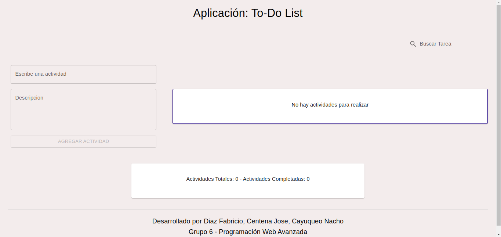
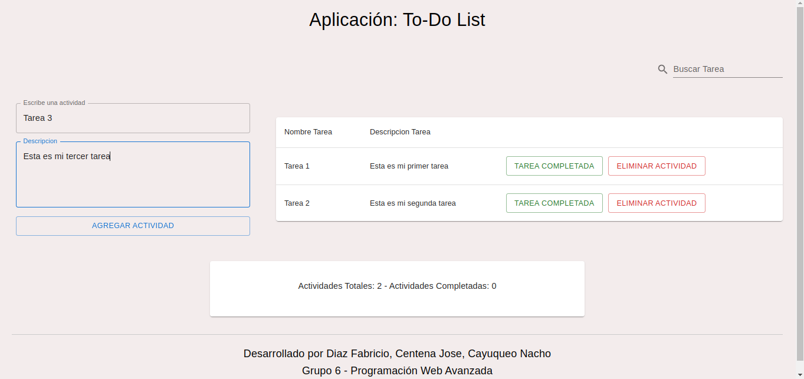
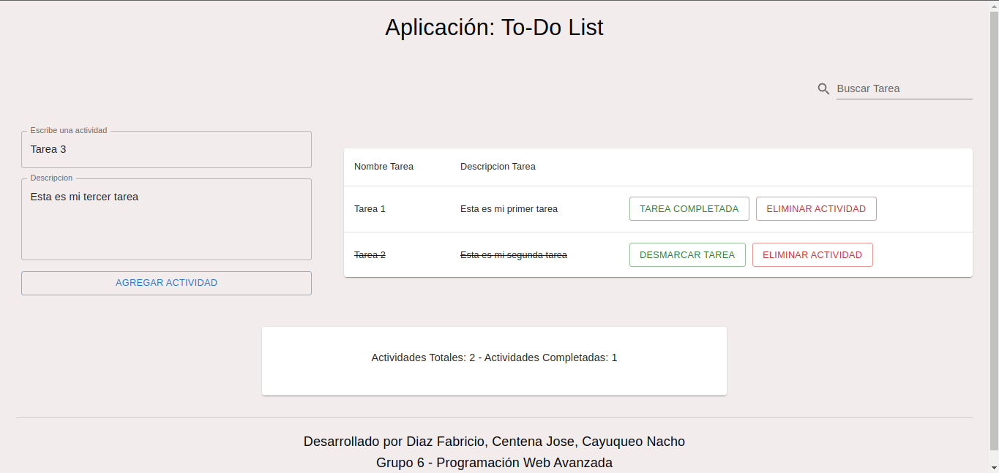
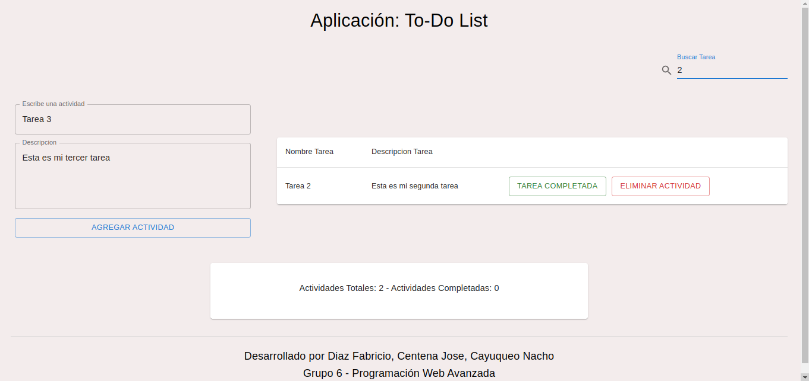

# Trabajo Práctico React

## Tabla de Contenidos

1. [Informacion General](#informacion-general)
   - [Breve Resumen](#breve-resumen)
   - [Preguntas](#preguntas)
2. [Tecnologias](#tecnologias)
3. [Instalacion](#instalacion)
4. [Clonar](#clonar)
5. [Desarrolladores](#desarrolladores)
6. [Informacion Adicional](#informacion-adicional)

# Informacion General

## Breve Resumen

¡Bienvenido a la To-Do List App!

Esta aplicación construida en React es tu aliado perfecto para organizar tus tareas diarias de manera eficiente. Con esta aplicación, puedes agregar fácilmente nuevas tareas, marcarlas como completadas y eliminarlas cuando lo desees. Cada tarea viene con una descripción detallada

Además, la aplicación cuenta con un buscador que te permite encontrar rápidamente tareas específicas escribiendo una palabra clave en el campo de búsqueda.

Por ultimo cuenta con un contador que te muestra el número total de tareas y el número de tareas completadas, para que puedas tener una visión clara de tu progreso.






## Preguntas

### Funcionalidad Index.js, App.js, Index.js, Package-json

**Index.js:** Este archivo es el punto de entrada de su aplicación React, es el responsable de representar el componente Raiz (App.js) y adjuntar al documento HTML. Configurar React DOM y proporcionar la representación inicial de la aplicación.

**App.js:** Este es el componente principal de su aplicación React. Contiene la estructura y la lógica de la interfaz de usuario de la aplicación, puede definir los componentes y la funcionalidad dentro de este archivo.

**Index.css:** Este archivo contiene estilo css globales que se aplican a todas aplicaciones. Le permite definir estilos que deben aplicarse,globalmente, afectando a todas las componentes dentro de la aplicación.

**Package-json.js:** Es el corazón de cualquier proyecto de node js. Registra meta-datos importante sobre un proyecto que se requieren antes de publicar en npm y también define los atributos funcionales de un proyecto que npm usa para instalar dependencia ejecutar scripts e identificar el punto de entrada a nuestro paquetes.

# Tecnologías

Para el desarrollo del proyecto se utilizó:

- 
- 
- 
- 
- 

# Instalacion

## Primer Paso:

Comprobar de tener instalado node.js, ejecutar en cmd node --version.

En caso de no tener instalado ingresar a la [pagina oficial de node js](https://nodejs.org/en/download)

## Segundo Paso:

Una que se vez que tenemos instalado node js instalamos NPM, ejecutar en cmd los siguiente comando:

```bash
npm install -g npm@latest
```

Corroboramos la version instalada:

```bash
npm --version
```

Limpiamos la cache por la dudas:

```bash
npm cache clean --force
```

## Tercer Paso:

Instalamos el create para la creacion del proyecto React ejecutamos en cmd:

```bash
npm install -g create-react-app
```

## Cuarto Paso:

Nos posicionamos en la carpeta donde vamos a crear el proyecto ej en nuevacarpeta y ejecutamos el siguiente comando:

```bash
create-react-app proyectoreact
```

## Quinto Paso:

Ejecutamos el servicio para saber si quedo instalado:

```bash
npm start
```

# Clonar

## Primero Paso:

Descargamos e instalamos [git de la pagina oficial](https://git-scm.com/)

# Configuramos el git:

- abrimos terminal de git y configuracion la cuenta:

  Jose@NB01 MINGW64 ~

  git config --global user.name "josetomy07"

  Jose@NB01 MINGW64 ~

  git config --global user.email jose.centena@est.fi.uncoma.edu.ar

## Segundo Paso:

Nos posicionamos donde creamos el proyecto React y ejecutamos el siguiente comando:

```bash
git init
```

## Tercer Paso:

Creamos el repositorio en github para esto vamos al cito oficial de github en la opcion donde tenemos el boton del +

buscamos **new repository**, una vez que estamos en pagina de create a new repository. En la opcion donde dice Repository name agregamos el nombre de nuestro proyecto, verificamos que este tildada la opcion Public y despues le damos a **create Repository**.

## Cuarto Paso:

Una vez que estamos en nuestra aplicacion de editor de codigo ya se visual estudio, etc. abrimos la terminal y ejecutamos las instrucciones que nos da el cito de gtihub:

- Copiamos la ruta que nos da el github

- En la terminal ejecutamos:

```bash
git remote add origin https://github.com/josetomy07/proyectoreact.git
```

```bash
git branch -M main
```

```bash
git push -u origin main
```

# Desarrolladores

### Cayuqueo Nacho Emanuel

- **Correo Institucional**: nacho.cayuqueo@est.fi.uncoma.edu.ar
- **GitHub**: [NachoCayuqueo](https://github.com/NachoCayuqueo)

### Centena Jose

- **Correo Institucional**: _@est.fi.uncoma.edu.ar_
- **GitHub**: [JoseCentena](https://github.com/josetomy07)

### Diaz Fabricio

- **Correo Institucional**: _@est.fi.uncoma.edu.ar_
- **GitHub**: [diazfabrici0](https://github.com/diazfabrici0)

# Información Adicional

- **Trabajo Practico React**: Aplicación de Lista de Tareas (To-Do List)
- **Docentes**: Lidia López - Agustín Chiarotto
- **Materia**: Programación Web Avanzada
- **Departamento**: Departamento de Programación
- **Carrera**: Tecnicatura Universitaria en Desarrollo WEB
- **Facultad**: Facultad de Informática
- **Año**: 2024
